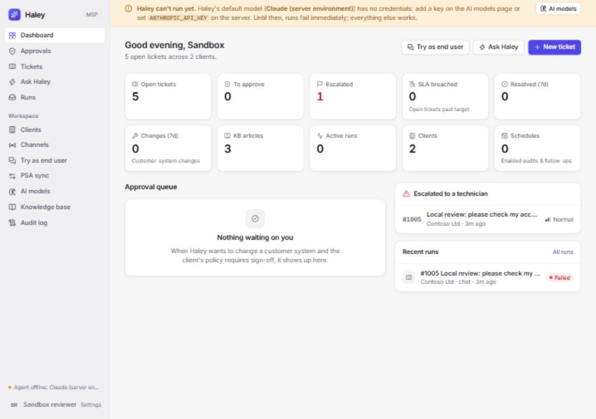
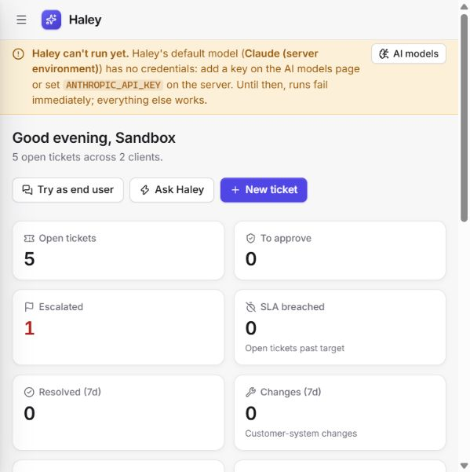
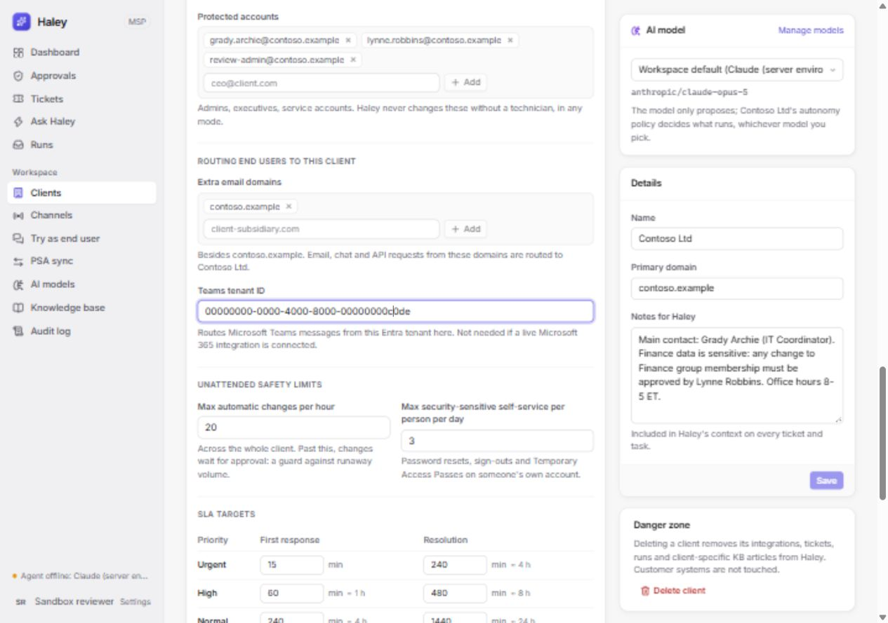
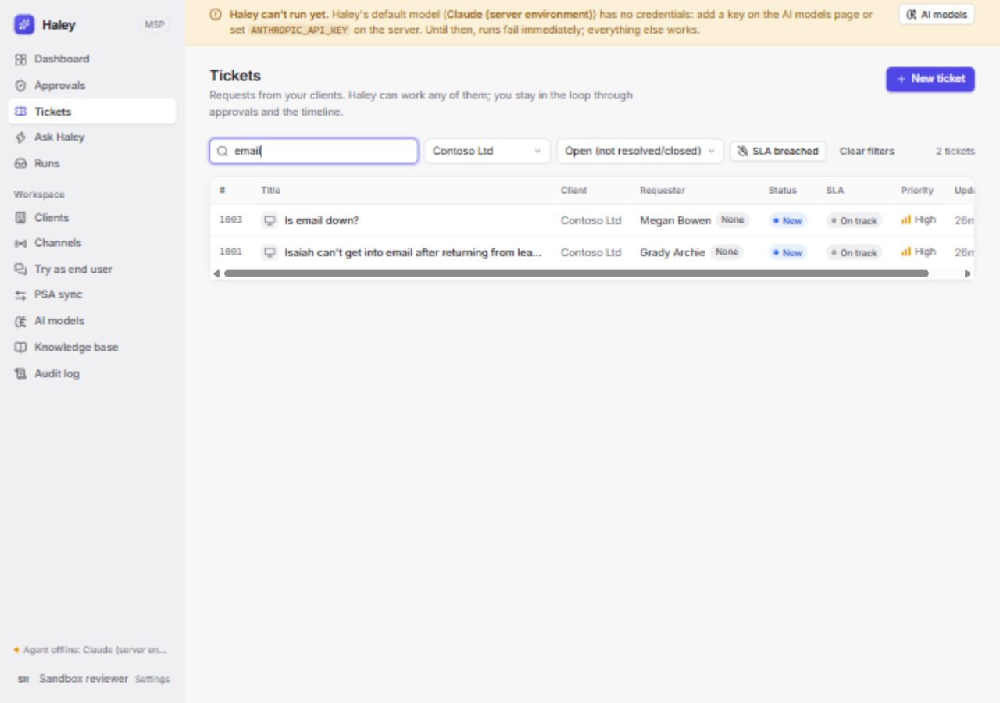
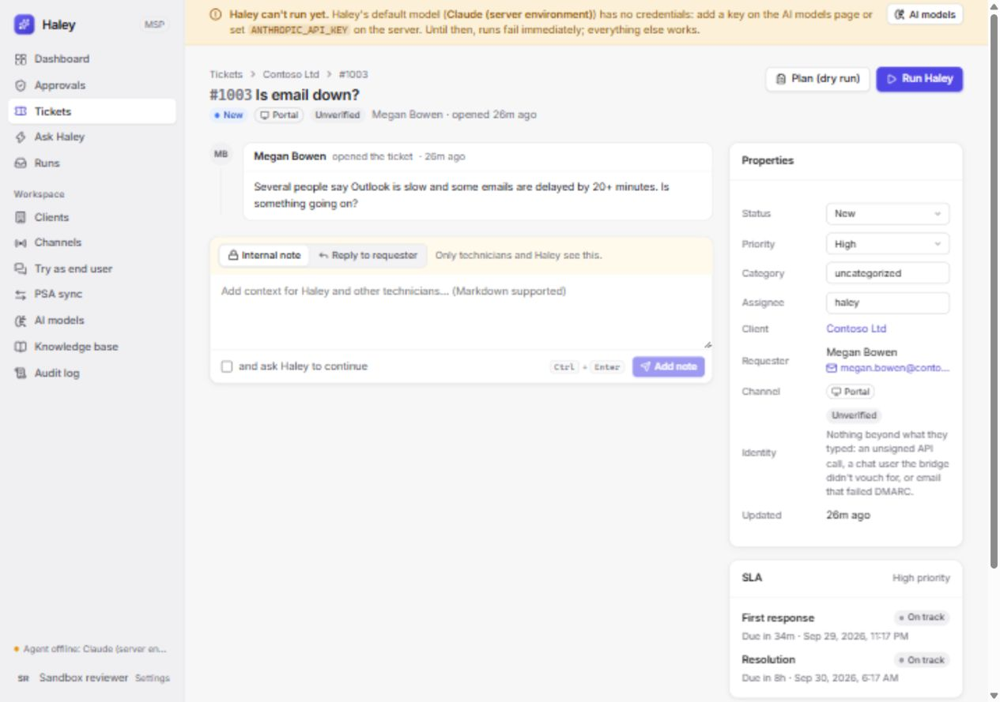
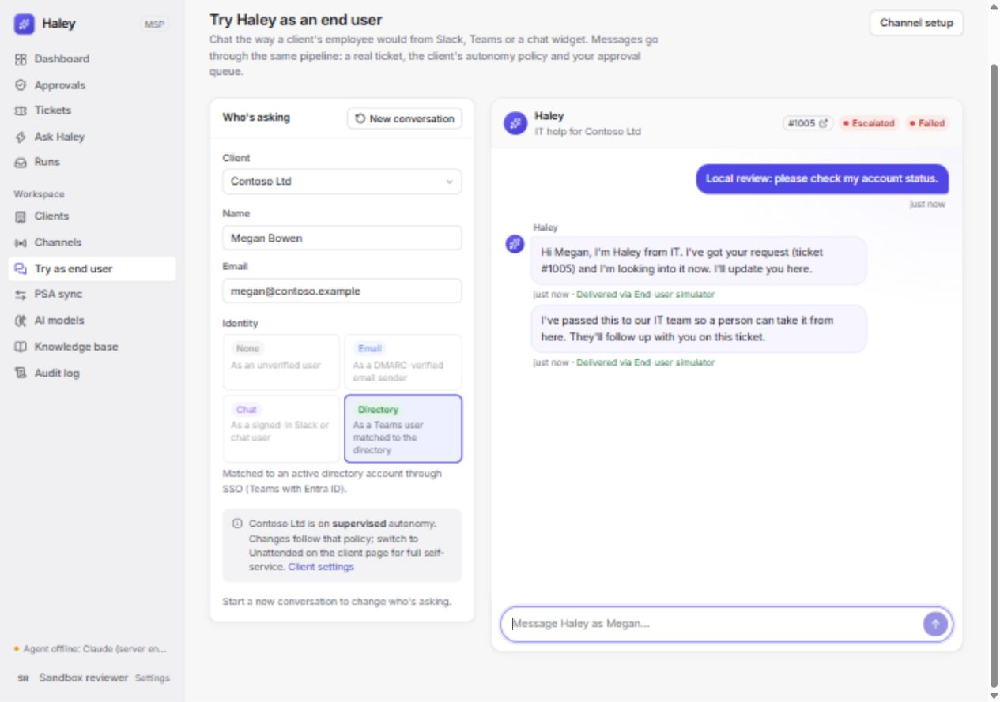
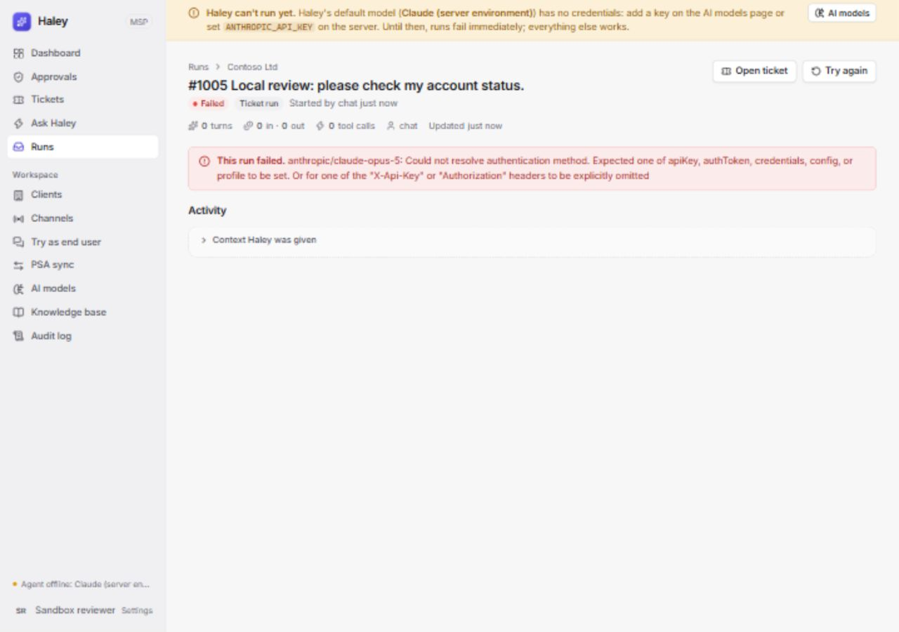
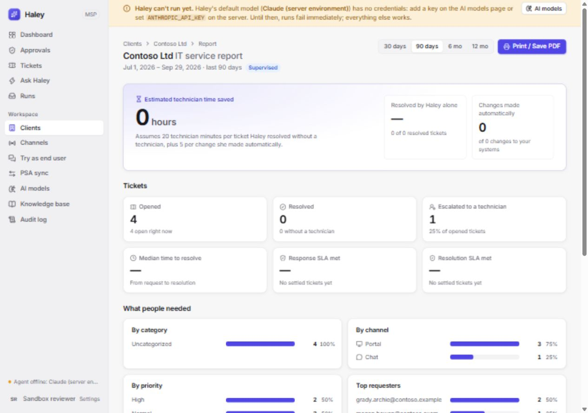
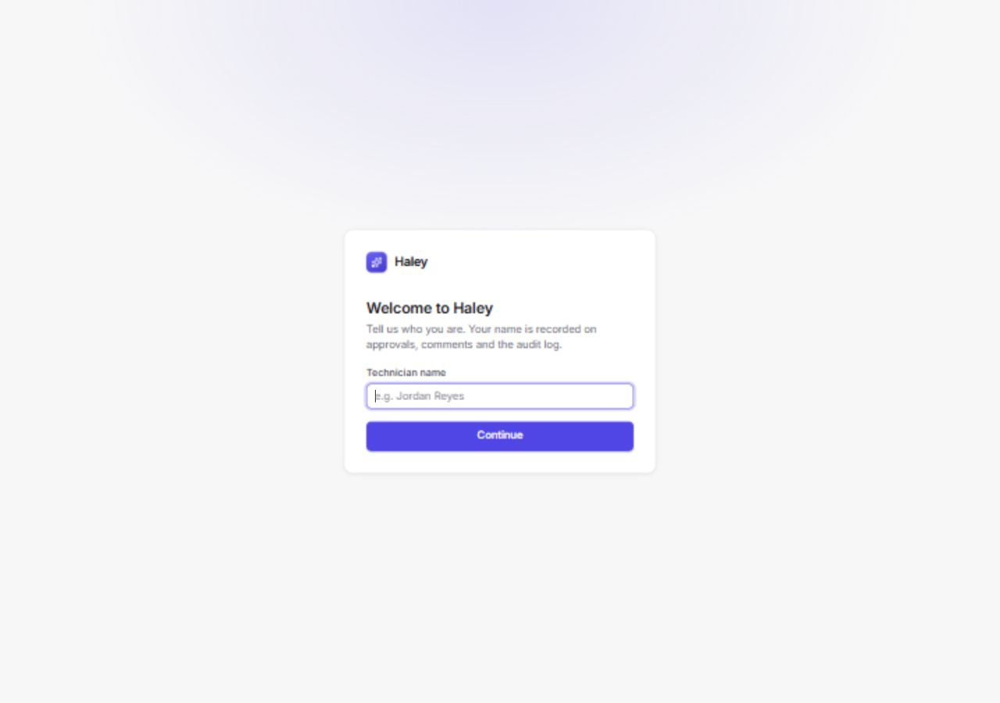

# Haley review and improvement pass — 2026-09-29

Haley has a useful foundation: client-scoped connectors, sandbox tenants, explicit approval policies, encrypted credentials and a coherent technician dashboard. This pass fixes concrete safety and state-consistency bugs, reduces unnecessary work and improves everyday interactions. Individual authenticated technician identity is the next priority before relying on named approvals across a team.

## Scope and acceptance

Repository: [BloodcraneRT/Haley](https://github.com/BloodcraneRT/Haley), review baseline main `db47e57b9123af3c54be1ee3d1ec1b785f416678`. This report accompanies the implementation and regression tests; Git history records publication.

Acceptance: reproduce bugs with failing regressions where practical; require current policy and pause checks before changes; preserve requester/client authority; keep polling, forms and search consistent; verify exact counts and honest reports; pass tests, typechecks, production build and browser checks.

The browser preview uses an isolated demo database on `http://127.0.0.1:8790`. No deployed service URL was available, and no live Microsoft 365, Google, PSA or outbound-channel writes were performed. The model key is deliberately absent. Fake model and sandbox integration tests cover agent behavior; the browser covers model-unavailable failure handling. Production behavior remains unverified.

## Implemented fixes

| Area | Reproduced problem | Result |
| --- | --- | --- |
| Execution and approvals | Pausing or changing policy during asynchronous checks, or while an approval waited, could leave a stale decision executable. | Recheck pause and current policy before execution and when approvals resume. New blocks, failed verification and changed named approvers prevent execution under an old approval. |
| Requester identity | Follow-ups could continue a ticket using another sender's authority or reuse MFA through an unverified message. | Require the same requester and sufficient channel assurance. Other channel messages become separate tickets; unmatched PSA comments remain on the technician timeline but are excluded from both prompt history and `get_ticket` results. Legitimate verified follow-ups retain session reuse. |
| Account ownership | Microsoft 365 object IDs and Google aliases could miss protected-account rules keyed by email. | Resolve the actual account before policy matching. Credential ownership uses that same canonical account, preserving verified self-service addressed by ID. |
| Safety lookup failures | Failed target, department or admin-group checks could be treated as an empty result and authorize a change. | Require technician review on failed checks. Admin-group checks no longer swallow provider errors. |
| Shared knowledge | An end-user ticket run could author a global article and affect other clients' guidance. | Ticket runs read shared articles but write only their own client's articles. Technician tasks retain global authoring. |
| Client summaries | Per-client filtering and integration queries repeated work; ticket counts truncated beyond the 10,000-row cap. | Aggregate open counts in SQL and group integrations once; exact counts without loading ticket bodies. |
| Value reporting | Manual resolutions, approvals and PSA technician work could count as autonomous resolution. Recent comments could inflate weekly resolutions. Failed-run escalations could be missed. | Require actual Haley resolution with no escalation or technician intervention. Use resolution timestamps. Count dedicated escalation events and escalated status transitions. Batch timeline flags instead of one history query per ticket. |
| Polling | Overlapping responses could overwrite newer data, optimistic edits or another record; visibility changes could restart stopped polling. | Ignore superseded responses, reset on record changes, coalesce automatic refreshes and honor dynamic stop intervals. |
| Client forms | Discovery applied settings on the server, while the form stayed stale; saving could overwrite fresh settings. | Rebase untouched fields from server updates, preserve local edits and discovered list additions, and PATCH only edited fields. |
| Search and simulator | Debounced search could restore stale filters; a late simulator response could attach to another conversation/client. | Commit searches against current URL filters; disable client/reset while sending and ignore responses for superseded conversations. |
| UI feedback | Later refresh failures were hidden on ticket/run details; credential text implied secrets could never be revealed again; keyboard selection could lose focus after saving. | Show refresh errors while retaining loaded data, accurately describe audited credential reveals, and restore radio focus after saves. |
| Browser session | Sign-out retained the display name; no sign-out control was offered without an API token. | Clear both token and name; offer sign-out for the local browser session too. |
| Loading | Every screen shipped in one main entry bundle. | Load workspace pages on demand while keeping the shell and sign-in available, with a page-loading fallback. |
| Startup | The quick start suggested a `.env` file that the scripts never loaded. | Dev/start load optional root and server files; process variables retain precedence. No extra configuration dependency. |

Primary implementation: `server/src/agent/runner.ts`, `server/src/channels/hub.ts`, connector tools, `server/src/store.ts`, `server/src/report.ts`, `web/src/hooks/`, `web/src/components/OrgSafety.tsx`, `web/src/pages/` and startup scripts. New regression suites: `server/test/safety-regressions.test.ts`, `server/test/reporting-regressions.test.ts`, `web/test/`. Root `npm test` and CI now include web tests.

The kill switch prevents another change from starting after its last check; it cannot recall a provider request already sent. A technician may approve a change that needs review because a safety lookup failed. These checks do not turn the shared technician token into individual authentication.

## Measured efficiency

| Measurement | Before | After | Interpretation |
| --- | --- | --- | --- |
| Main JavaScript entry, Vite production build | 664.92KB / 192.44KB gzip | 243.27KB / 76.51KB gzip | About 63% less in the main entry. Screens and shared modules load additional chunks; this is not the total bytes for every screen. |
| Client summary calculation, synthetic 100 clients / 10,000 open tickets, median of 15 samples | 83.77ms | 1.15ms | Equivalent counts, batched queries. This measures the calculation in isolation, not network or whole-service latency. |

The benchmark script and environment smoke fixture are in the session scratch directory, outside the project tree. New account-resolution reads are intentional: account rules must identify the real owner. No speculative connector cache or retry layer was added.

## Verification evidence

| Command or check | Result |
| --- | --- |
| Baseline `npm --prefix server test` | 118 tests passed. |
| `npm test` | 144 server tests across 11 files; 12 web tests across 3 files passed. |
| `npm run typecheck` | Server and web typechecks passed. |
| `npm run build` | Vite production build and server TypeScript build passed. |
| Targeted reporting regression | First failed with `expected 0 to be 1`; fixed implementation passed all 5 reporting tests. |
| Environment smoke | Old startup ignored `.env`; new flags passed root/server loading, process precedence, `tsx` and missing-file checks. |
| Browser run without model credentials | Escalated to a technician; run recorded 0 model turns, 0 tokens and 0 tool calls. |
| Browser client report | Counted that escalation as 1, matching ticket/dashboard state. |
| `git diff --check` | Passed. |
| `npm --prefix server audit --json` / `npm --prefix web audit --json` | Both returned 0 known dependency vulnerabilities. |

Backend and frontend audits used subagents. The separate fresh-context correctness review was partial because the workspace reported a credit limit. Findings received were checked and addressed; remaining verification was completed directly. This is not a claim of a completed independent review.

The optional environment-file flag is present in the supported Node 22.13 runtime; file precedence follows [Node's CLI documentation](https://nodejs.org/download/release/v22.13.0/docs/api/cli.html#--env-file-if-existsconfig).

## Browser walkthrough

Screenshots below contain synthetic demo data. Desktop checks used 1280×900; the responsive check used the normal narrow Codex browser pane. These checks do not establish complete screen-reader or contrast compliance.

### 1. Dashboard — healthy in the configured sandbox

Counts, links and empty states load coherently. The missing-model banner identifies the limitation and offers model setup. Narrow layout keeps actions and summary cards accessible through the navigation menu. No visual redesign was needed.

### 2. Client discovery and safety — fixed

Before: discovery reported its settings applied while the form showed empty protected accounts/tenant ID and enabled Save. After: the form shows the discovered admins and tenant ID, retains a local protected-account addition, and disables Save when clean. Arrow-key autonomy selection saved successfully and retained focus; the demo client was restored to Supervised. The long page remains a candidate for section navigation later.

### 3. Ticket search and detail — healthy

Typing `email` and immediately choosing Contoso retained both URL filters and returned two matching tickets. Detail navigation loaded the requester, timeline, composer and SLA. The table scrolls horizontally at this width; column prioritization is a later polish opportunity.

### 4. Simulator and run feedback — handoff healthy; model execution unavailable

A synthetic request created ticket #1005, acknowledged it and escalated it when no model credentials were available. The run displays its actual failure and zero usage. Successful model conversations and live private credential delivery need a separately authorized live check. The raw provider error could be paired with a shorter setup explanation in a future pass.

### 5. Client report — fixed and healthy for this fixture

The report now counts the failed-run escalation and shows no unsupported savings claim: 1 escalation, 0 autonomous resolutions, 0 estimated hours saved. Period controls and the existing print action remain visible; PDF export itself was not exercised.

### 6. Sign-out — fixed

Sign-out clears the browser identity and returns to the blank name-entry screen even in the local no-token configuration. Signing back in restores the workspace. This is browser-session behavior, not proof of individual technician authentication.

## Recommended next work

| Priority | Improvement | Why and evidence | Pass/fail check |
| --- | --- | --- | --- |
| First | Individual technician authentication and roles | `actor(req)` trusts `x-haley-user`; named approver comparisons use that display name. A shared-token holder can choose another name, so attribution and named approval separation are not strong identity guarantees. | A technician cannot approve as another identity, alter restricted client policy or reveal credentials outside their role. Use an agreed identity provider; avoid building a second identity system. |
| Next | Paginated queues and work selection in SQL | Tickets API defaults to a bounded list; scheduler scans only 10,000 open tickets, PSA export only the latest 500 per client, and reports cap ticket/action scans at 100,000. These remaining caps can hide older work at scale. Counts are fixed in this pass, but these workflows still need pagination. | Fixtures above each cap prove older eligible rows are returned, scheduled, exported and reported exactly once. |
| Next | Guided readiness and troubleshooting | The missing-model banner is helpful, but actions still allow a run that immediately fails. A compact readiness checklist could connect model setup, tenant test, discovery and channel verification with a safe first plan. | A new operator reaches one successful sandbox plan and understands each unmet prerequisite without reading setup docs. |
| Later | Drain active work during shutdown | Server close hooks stop the scheduler and close SQLite; review active agent/background delivery tasks before relying on rolling restarts. This is a code-review concern, not a reproduced live loss. | Stop a process during a controlled pending tool/delivery; no closed-database writes, lost result or duplicate external action on restart. |
| Later | Improve long-page navigation and dense ticket tables | Screenshot steps 2 and 3 show a long client page and horizontal table scrolling. Keep the existing visual system; add section links and prioritize visible columns if operators confirm the friction. | Keyboard and narrow-screen users can reach safety/settings and inspect ticket identity/status without unnecessary scrolling. |

Live deployment, tenant permissions, provider rate limits, successful MFA/credential delivery, PSA throughput and model quality were not measured. Validate against the actual service URL and agreed sandbox clients before deploying.

## Session handoff

- Local project status was reconciled in the vault. Preview data and experiment scripts remain in the session scratch directory, outside the repository.
- Restart the built preview after rebuilding web assets: the current static-server configuration enumerates files at startup. Production deployment should build before starting its process.
- No deployment was performed during this review.
