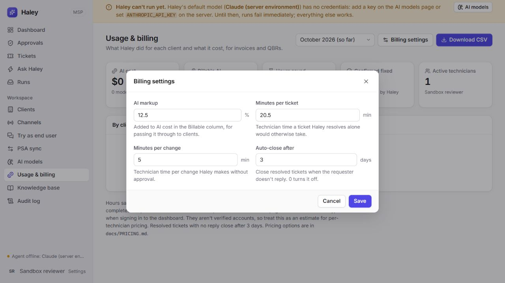
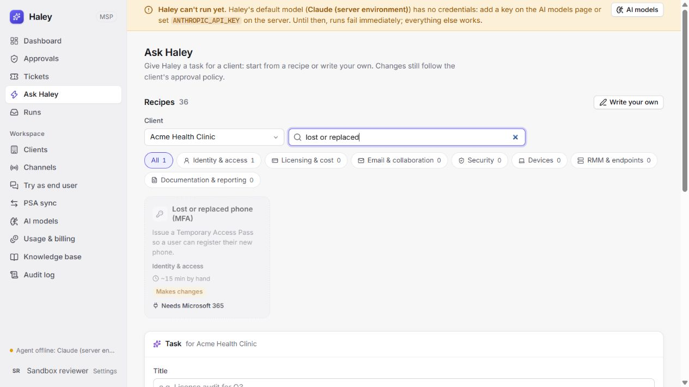

# Haley review — October 1, 2026

Reviewed the integration, recipe, client memory and billing work through main `e24a31c`. This follow-up adds fixes and 30 regression tests. Rashid requested committing and pushing this pass. No production deployment or live tenant writes were performed. The full review and screenshots are also saved in the authoritative Obsidian vault; this file is the repository mirror.

## Problems reproduced and fixed

| Area | Problem | Result |
| --- | --- | --- |
| Requester confirmation | Any requester reply allowed the agent to submit invented or stale confirmation evidence. An older Haley resolution could be reused after a technician resolved the ticket. Reopening retained confirmation. | Evidence must quote the latest trusted requester reply after the latest resolution, which must be Haley's. The audit event links the reply. Reopening clears confirmation. |
| PSA imports | One failed import followed by a newer successful import advanced the cursor past the failed ticket. | Failed pull batches retain their original cursor for the next sync. Already-linked tickets can be replayed. |
| PSA exports | The newest 500 tickets could all be linked, permanently hiding older eligible tickets. | SQL selects eligible unlinked tickets before applying the batch limit, oldest first. Removes per-ticket link lookups from this selection. |
| PSA credentials | Credential-bearing requests followed redirects; Autotask response pagination could choose a different credential destination. | Redirects are rejected. Autotask paging requests must stay within the configured HTTPS origin and API path. |
| PSA pagination | Adapter page caps silently returned partial collections, risking cursor advancement over omitted work. | Incomplete collections raise explicit errors. Exact-cap complete results still succeed using totals or an empty probe page. |
| Billing periods | Reconstructing the start from rounded days included activity before a partial-day billing period. End instants were inconsistent with model usage. | Exact supplied starts are preserved and supplied ends are exclusive. |
| Savings and pricing | Changes were credited when proposed rather than executed; failed recipe actions outside the period were ignored; a general model alias could override exact snapshot pricing. | Executed timestamps determine change credit. Whole-run action history determines recipe completion. Exact model snapshots take precedence. |
| Scheduled recipes | Scheduling discarded the recipe ID, so completed scheduled recipes lost recipe attribution and savings credit. | Schema migration 9 preserves the ID through API, UI, schedule storage and task execution. Plan runs remain excluded from savings. |
| Recipe UI | Switching clients could temporarily expose the previous client's availability; failures were hidden. | Availability and submission are gated by the current client, with visible errors and Retry. |
| Client memory | An open editor could survive client navigation; pending writes allowed duplicate submissions and replacement editors. | Client navigation remounts the editor. Pending writes block duplicate saves and dismissal. |
| Pricing and usage UI | Pasted negative prices became positive; clients with only automatic changes disappeared; fractional billing values were blocked by browser validation. | Negative prices are rejected, zero remains valid, automatic-change clients appear, fractional markup/time values save, and auto-close days remain integral. |

Recipe completion checks now use a set of incomplete run IDs instead of scanning the action list separately for every recipe. These query and lookup improvements were checked for correct results; no new service latency benchmark was run.

## Verification

- Baseline: 202 server + 12 web tests passed.
- Final `npm test`: **226 server + 18 web tests passed** (244 total, 23 files).
- `npm run typecheck`: server and web passed.
- `npm run build`: web production build and server compilation passed. Main JS remains 245.16 kB (77.12 kB gzip); route chunks load separately.
- `git diff --check`: passed.
- New tests reproduce the billing, confirmation, sync, adapter and form failures before their fixes. Scheduled recipe tests cover API creation, scheduler execution, live/plan attribution and report credit.
- Fresh-context correctness review found no confirmed gap in the billing, frontend, adapter and confirmation changes. It stopped at a workspace credit limit before the final sync/scheduling changes; those received direct review and regression checks.

The rebuilt service ran on loopback port 8791 with a separate scratch database and no model credentials. It successfully opened the existing preview database with migration 9. Browser checks verified:

1. Creating a planned License audit schedule and reading back `template_id: license-audit`.
2. Saving a client memory note and reading it back as active technician memory.
3. Saving and reopening billing settings with 12.5% markup and 20.5 minutes per ticket; browser validity passed.
4. Switching from Contoso's Microsoft 365 tenant to Acme's Google Workspace tenant; the Microsoft-only MFA recipe becomes disabled with its missing integration stated.
5. No captured browser console errors on the checked recipe flow.

[Saved schedule screenshot](review-assets/2026-10-01/scheduled-recipe.png)

## Remaining priorities and limits

1. **Authenticated technician identities and roles.** Typed names remain an estimate for technician billing and attribution. A shared API token does not establish individual identity.
2. **Large-workspace pagination.** Provider cap failures are explicit now; they still require narrower queries or a designed paging strategy. Report reads still cap at 100,000 records. Halo action-history completeness has not been verified against a live tenant.
3. **Live integration acceptance.** The supplied URL was the repository. No deployed service URL or live credentials were available; provider behavior was tested with scripted responses, and model behavior with scripted models. Verify real adapters and deployment separately before release.
4. **Confirmation semantics.** Quote validation prevents fabricated and stale evidence. The model still interprets whether the quoted reply expresses a successful fix; these checks are not a natural-language sentiment guarantee.

Preserve the existing architecture; prioritize identity and evidence-based live checks before expanding automation scope. Publication status and the verified commit are recorded in the vault project note.
